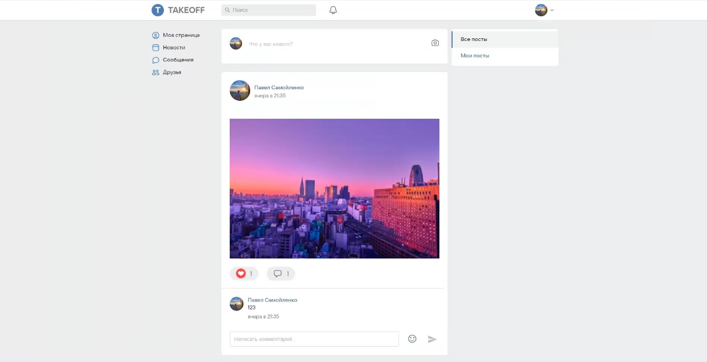

# Server for social network Takeoff

* [Available Scripts](#Available-Scripts)
* [Project description](#Project-description)
* [Demo](#Demo)
* [Technical specifications](#Technical-specifications)

## Available Scripts

In the project directory, you can run:

### `npm run dev`
Runs the server on localhost:4000.\

## Project description

The project implements:
* personal messages
* creating posts
* likes post
* comments on posts
* uploading an avatar
* profile editing
* password change
* profile removal
* adding and deleting from friends
* search for people
* load and resize images
* instant notifications using a socket.

## Demo

* :point_right: Here you can see [Demo](https://takeoff-client.vercel.app).
* :point_right: Here you can see [Frontend](https://github.com/PaulSamPS/takeoff-client).

## Technical specifications
* Node js
* JavaScript
* Express
* Socket Io
* Mongoose
* MongoDb